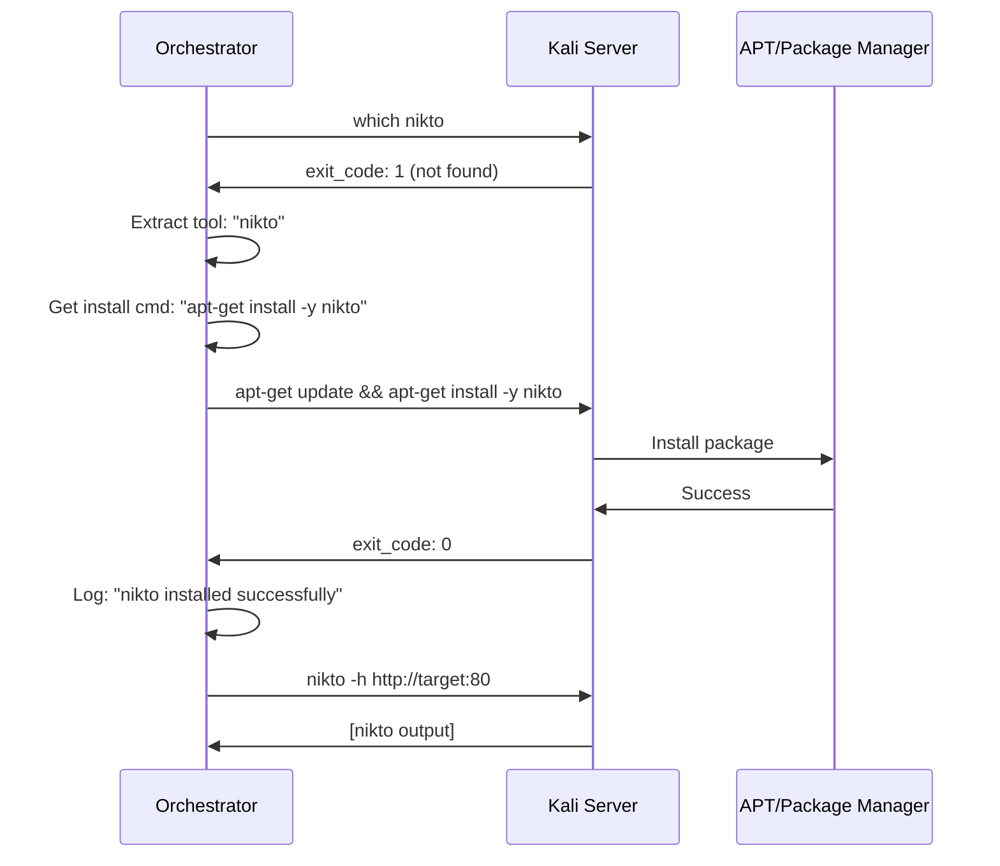

# Automatic Tool Installation

## 🎯 Overview

**Version 0.2.0** introduces **automatic tool installation**: the orchestrator now detects when a security tool is missing on the Kali server and installs it automatically before execution.

This eliminates the need for manual tool setup and ensures audits can run even on minimal Kali installations.

---

## 🚀 How It Works

### **Workflow**



### **Step-by-Step**

1. **Task Scheduled**: Orchestrator prepares to run `nikto -h http://10.19.220.25:8088`

2. **Tool Extraction**: Extracts tool name from command
   ```python
   extract_tool_name("nikto -h http://...") → "nikto"
   ```

3. **Check Installation**:
   ```bash
   # Kali Server
   $ which nikto
   # Exit code 1 → not found
   ```

4. **Install Tool**:
   ```bash
   # Kali Server
   $ apt-get update && DEBIAN_FRONTEND=noninteractive apt-get install -y nikto
   Reading package lists...
   Installing: nikto (1:2.5.0-1kali1)
   ...
   nikto set up successfully
   # Exit code 0 → success
   ```

5. **Log to Bitacora**:
   ```
   [2026-09-30 18:00:15] INSTALL: nikto
   [2026-09-30 18:00:15] Tool not found, installing...
   [2026-09-30 18:01:23] INSTALL: nikto
   [2026-09-30 18:01:23] RESULT: success
   ```

6. **Execute Original Command**:
   ```bash
   $ nikto -h http://10.19.220.25:8088
   - Nikto v2.5.0
   ...
   ```

---

## 📦 Supported Tools

### **Standard Tools (via apt)**

Installed using `apt-get install -y <package>`:

| Tool | Package | Category |
|------|---------|----------|
| nmap | nmap | Network scanning |
| masscan | masscan | Network scanning |
| nikto | nikto | Web scanning |
| whatweb | whatweb | Web fingerprinting |
| wafw00f | wafw00f | WAF detection |
| wpscan | wpscan | WordPress scanning |
| dirb | dirb | Directory fuzzing |
| gobuster | gobuster | Directory fuzzing |
| sslscan | sslscan | SSL/TLS analysis |
| sslyze | sslyze | SSL/TLS analysis |
| ssh-audit | ssh-audit | SSH auditing |
| enum4linux | enum4linux | SMB enumeration |
| smbclient | smbclient | SMB client |
| curl | curl | HTTP client |
| wget | wget | HTTP client |
| nc | netcat-traditional | Network utility |
| telnet | telnet | Telnet client |
| dig | dnsutils | DNS query |
| nslookup | dnsutils | DNS query |
| host | bind9-host | DNS query |
| mysql | mysql-client | MySQL client |
| psql | postgresql-client | PostgreSQL client |

### **Special Tools (custom installation)**

Tools that require custom installation methods:

#### **testssl.sh**
```bash
# Try apt first, fallback to git clone
apt-get install -y testssl.sh || \
  (cd /opt && git clone --depth 1 https://github.com/drwetter/testssl.sh.git && \
   ln -sf /opt/testssl.sh/testssl.sh /usr/local/bin/testssl.sh)
```

#### **ffuf**
```bash
# Try apt first, fallback to GitHub release
apt-get install -y ffuf || \
  (cd /tmp && wget https://github.com/ffuf/ffuf/releases/latest/download/ffuf_linux_amd64.tar.gz && \
   tar -xzf ffuf_linux_amd64.tar.gz && \
   mv ffuf /usr/local/bin/ && chmod +x /usr/local/bin/ffuf)
```

#### **nuclei**
```bash
# Try apt first, fallback to GitHub release
apt-get install -y nuclei || \
  (cd /tmp && wget https://github.com/projectdiscovery/nuclei/releases/latest/download/nuclei_linux_amd64.zip && \
   unzip nuclei_linux_amd64.zip && \
   mv nuclei /usr/local/bin/ && chmod +x /usr/local/bin/nuclei)
```

---

## 🔧 Configuration

### **No Configuration Needed!**

The orchestrator works out-of-the-box with sensible defaults:

- **Check timeout**: 10 seconds
- **Install timeout**: 300 seconds (5 minutes)
- **Package manager**: apt-get (Debian/Kali standard)
- **Environment**: `DEBIAN_FRONTEND=noninteractive` (no prompts)

### **Tool → Package Mapping**

Defined in `src/audit_orchestrator/core/tool_installer.py`:

```python
TOOL_PACKAGES = {
    "nmap": "nmap",
    "nikto": "nikto",
    "dig": "dnsutils",  # dig → dnsutils package
    "rpcclient": "samba-common-bin",  # rpcclient → samba-common-bin
    ...
}
```

To add a new tool, simply update this dictionary.

### **Custom Tool Installation**

For tools not in apt or requiring special setup:

```python
SPECIAL_CASES = {
    "my-custom-tool": {
        "check": "which my-custom-tool",
        "install": "cd /opt && git clone https://github.com/user/my-custom-tool.git && ..."
    }
}
```

---

## 📊 Logging

All installation attempts are logged to:

1. **SQLite bitacora table**:
   ```sql
   SELECT * FROM bitacora_entries WHERE operation LIKE 'INSTALL:%';
   ```

2. **Target's bitacora file**: `<target>/bitacora/bitacora_<date>.log`
   ```
   [2026-09-30 18:00:15] INSTALL: nikto
   [2026-09-30 18:00:15] Tool not found, installing...
   [2026-09-30 18:01:23] INSTALL: nikto
   [2026-09-30 18:01:23] RESULT: success
   ```

### **Log Levels**

- `INSTALL: <tool>` with `details: "Tool not found, installing..."` → Installation started
- `INSTALL: <tool>` with `result: "success"` → Installation succeeded
- `INSTALL: <tool>` with `result: "failed"` → Installation failed
- `INSTALL: <tool>` with `result: "error"` → Unexpected error during check/install

---

## ❌ Error Handling

### **Installation Failures**

If tool installation fails:

1. **Task marked as failed** in database:
   ```sql
   UPDATE audit_tasks 
   SET status = 'failed', 
       error = 'Failed to install nikto: <error message>'
   WHERE task_id = '...';
   ```

2. **Logged to bitacora**:
   ```
   [2026-09-30 18:01:23] INSTALL: nikto
   [2026-09-30 18:01:23] RESULT: failed
   [2026-09-30 18:01:23] DETAILS: Failed to install nikto: E: Package not found
   ```

3. **Audit continues**: Other tasks/targets proceed normally (fault-tolerant)

### **Unknown Tools**

If a tool is not in the mapping:

```python
extract_tool_name("my-unknown-tool --scan") → "my-unknown-tool"
get_package_name("my-unknown-tool") → "my-unknown-tool"  # Defaults to tool name
get_install_command("my-unknown-tool") → "apt-get install -y my-unknown-tool"
```

The orchestrator attempts `apt-get install -y my-unknown-tool`. If it fails, the task is marked as failed and logged.

---

## 🧪 Testing

### **Run Test Suite**

```bash
cd /opt/cline-mcps/MVP-audit-orchestrator
python3 scripts/test_tool_installer.py
```

**Output:**
```
================================================================================
  TOOL INSTALLER - Test Suite
================================================================================
🧪 Testing Tool Name Extraction
================================================================================
✅ 'nmap -sV -p 80 10.0.0.1' → nmap (expected: nmap)
✅ 'nikto -h http://example.com' → nikto (expected: nikto)
...

🧪 Testing Tool → Package Mapping
================================================================================
✅ nmap → nmap (expected: nmap)
✅ dig → dnsutils (expected: dnsutils)
...

================================================================================
  TEST SUMMARY
================================================================================
  ✅ PASS     Tool Extraction
  ✅ PASS     Package Mapping
  ✅ PASS     Check Commands
  ✅ PASS     Install Commands
================================================================================

✅ All tests passed!
```

### **Manual Test**

To test installation on Kali server:

```python
# MCP Client (LLM)
audit_run(project_id="xxx", max_targets=1)

# Watch logs
tail -f /home/f0ns1/RedTeam/OCSR25/PoC/<target>/bitacora/bitacora_*.log
```

Look for `INSTALL:` entries in the logs.

---

## 🔒 Security Considerations

### **Permissions Required**

The Kali server must have:

1. **Root/sudo access** for `apt-get install`
2. **Internet access** for package downloads and GitHub releases
3. **Write access** to `/usr/local/bin`, `/opt`, `/tmp` (for custom tools)

### **Network Dependencies**

Installation requires internet access to:
- **Debian/Kali repos**: `apt.kali.org`, `deb.debian.org`
- **GitHub**: For custom tool downloads (testssl.sh, ffuf, nuclei)

If the Kali server is air-gapped:
- Pre-install all tools manually
- Or mount package cache/mirror locally

### **Time Overhead**

First-time installation adds overhead:
- **Standard apt package**: ~30-60 seconds
- **Custom tool (git clone)**: ~60-120 seconds
- **Binary download**: ~10-30 seconds

Subsequent runs reuse installed tools (no overhead).

---

## 📝 Best Practices

### **1. Pre-install Common Tools**

For production environments, pre-install common tools to reduce audit time:

```bash
# On Kali server
apt-get update
apt-get install -y nmap nikto sslscan whatweb wafw00f wpscan ffuf dirb \
                   gobuster ssh-audit enum4linux curl wget nc telnet \
                   dnsutils mysql-client postgresql-client
```

### **2. Monitor Installation Logs**

Check bitacora for installation issues:

```bash
# View installations for a project
sqlite3 ~/.local/share/audit-orchestrator/audit_state.db \
  "SELECT timestamp, operation, result, notes 
   FROM bitacora_entries 
   WHERE operation LIKE 'INSTALL:%' 
   ORDER BY timestamp DESC;"
```

### **3. Custom Tools**

For organization-specific tools, add them to `TOOL_PACKAGES` or `SPECIAL_CASES`:

```python
# src/audit_orchestrator/core/tool_installer.py

TOOL_PACKAGES["my-custom-scanner"] = "my-custom-scanner"

SPECIAL_CASES["proprietary-tool"] = {
    "check": "which proprietary-tool",
    "install": "curl https://internal-repo/tool.sh | bash"
}
```

### **4. Offline Installations**

For air-gapped environments:

1. **Create package cache**:
   ```bash
   # On online Kali
   apt-get download nmap nikto sslscan ...
   
   # Transfer .deb files to offline Kali
   # Install offline
   dpkg -i *.deb
   ```

2. **Disable auto-install** (future feature):
   ```python
   # In settings
   settings.auto_install_tools = False
   ```

---

## 🚀 Future Enhancements

### **Planned Features**

- [ ] **Version pinning**: Install specific tool versions
- [ ] **Cache installations**: Skip `apt-get update` if recent
- [ ] **Parallel installation**: Install multiple tools concurrently
- [ ] **Tool validation**: Verify tool works after installation (e.g., `nmap --version`)
- [ ] **Offline mode**: Disable auto-install for air-gapped environments
- [ ] **Installation metrics**: Track installation time, success rate

### **Configuration Options (v0.3.0)**

```python
# settings.py
class Settings:
    auto_install_tools: bool = True  # Enable/disable auto-install
    install_timeout: int = 300       # Max seconds per installation
    check_timeout: int = 10          # Max seconds for tool check
    allow_git_installs: bool = True  # Allow git clone installations
    allow_binary_downloads: bool = True  # Allow wget binary downloads
    package_cache_ttl: int = 3600    # Seconds to cache apt-get update
```

---

## 📚 Code Reference

### **Key Files**

- `src/audit_orchestrator/core/tool_installer.py`: Tool detection and installation logic
- `src/audit_orchestrator/core/orchestrator.py`: `_ensure_tool_installed()` method
- `scripts/test_tool_installer.py`: Test suite

### **API**

#### **`extract_tool_name(command: str) -> Optional[str]`**

Extract tool name from command string.

**Example:**
```python
extract_tool_name("nmap -sV -p 80 10.0.0.1")
# → "nmap"
```

#### **`get_check_command(tool: str) -> str`**

Get command to check if tool is installed.

**Example:**
```python
get_check_command("nikto")
# → "which nikto"

get_check_command("testssl.sh")
# → "which testssl.sh || which testssl"
```

#### **`get_install_command(tool: str) -> str`**

Get command to install tool.

**Example:**
```python
get_install_command("nikto")
# → "apt-get update && DEBIAN_FRONTEND=noninteractive apt-get install -y nikto"

get_install_command("testssl.sh")
# → "apt-get update && apt-get install -y testssl.sh || (cd /opt && git clone ...)"
```

---

## 🎯 Summary

**Version 0.2.0** makes the Audit Orchestrator **self-sufficient**:

✅ **Zero manual setup**: No need to pre-install tools  
✅ **Self-healing**: Missing tools automatically installed  
✅ **Fault-tolerant**: Installation failures don't crash audit  
✅ **Logged**: Full audit trail of installations  
✅ **Extensible**: Easy to add custom tools  

**Result**: More reliable audits with less operational overhead.
