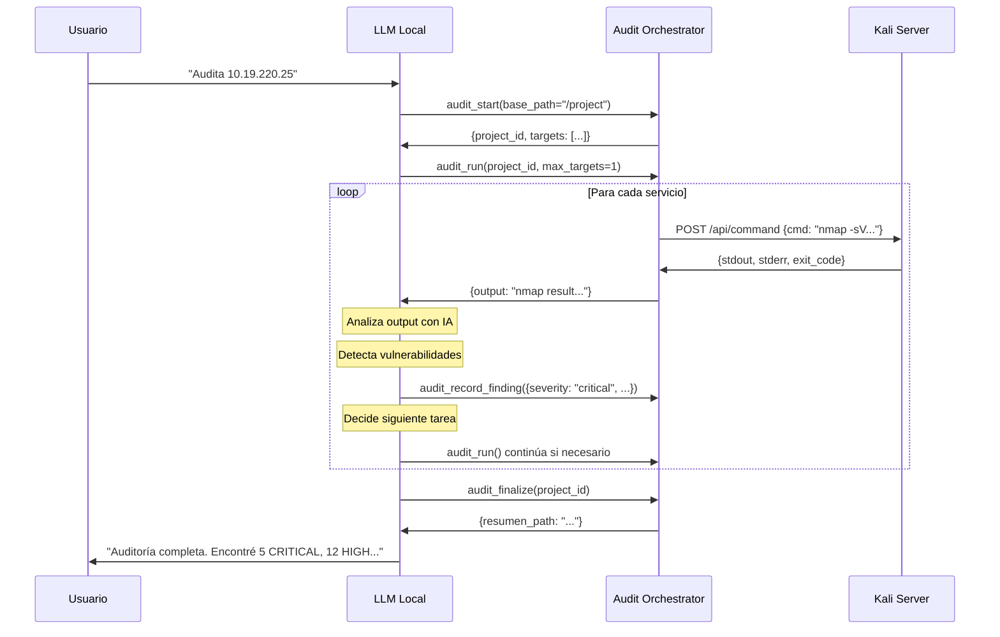

# Análisis de Integración del LLM en Audit Orchestrator

## 📊 Estado Actual del MVP (v0.1.3)

### ❌ **Limitación Crítica Identificada**

**El MVP actual NO utiliza el LLM para toma de decisiones**. Todo está automatizado mediante:
- Tareas predefinidas en `default_blackbox.json`
- Detección de findings por regex/keywords en `_analyze_for_findings()`
- Lógica determinística de Python

**El LLM solo actúa como:**
- 🤖 **Cliente MCP**: Llama a `audit_start()`, `audit_run()`, etc.
- 📞 **Proxy**: El orchestrator llama al MCP Kali Server
- ❌ **NO analiza outputs**
- ❌ **NO toma decisiones de seguridad**
- ❌ **NO interpreta contexto**

---

## 🎯 Puntos Donde el LLM DEBERÍA Intervenir

### 1️⃣ **Análisis Inteligente de Outputs** (CRÍTICO)

**Situación actual**: Regex básico
```python
# orchestrator.py línea 683
if any(kw in output_lower for kw in ["anonymous", "guest", "unauthenticated"]):
    findings.append({...})  # Muy limitado
```

**Lo que DEBERÍA hacer el LLM**:
```
Output de nmap:
  PORT     STATE SERVICE    VERSION
  8088/tcp open  ssl/http   Apache/2.4.41 (Ubuntu)
  | http-auth: HTTP/1.1 401 Unauthorized
  | Supported Authentication: Basic realm="Admin Panel"
  | Default credentials admin:admin123 accepted

LLM analiza:
  ✅ Detecta: Default credentials (admin:admin123)
  ✅ Detecta: Autenticación Basic sobre HTTPS (CWE-522)
  ✅ Detecta: Panel de administración expuesto (CWE-306)
  ✅ Genera: Finding con contexto completo
  ✅ Recomienda: Cambiar credenciales + implementar MFA
```

### 2️⃣ **Correlación de Findings** (IMPORTANTE)

**Situación actual**: Findings aislados
```
Finding 1: Puerto 445 (SMB) abierto
Finding 2: Puerto 135 (RPC) abierto
Finding 3: Puerto 139 (NetBIOS) abierto
```

**Lo que DEBERÍA hacer el LLM**:
```
LLM correlaciona:
  ✅ "Estos 3 puertos indican un Windows Server con SMB habilitado"
  ✅ "Alta probabilidad de vulnerabilidad EternalBlue si es Windows 7/2008"
  ✅ Genera finding agregado: "Windows SMB Exposure (Multiple Vectors)"
  ✅ Prioriza siguiente tarea: "Ejecutar enum4linux y smb-vuln-ms17-010"
```

### 3️⃣ **Selección Dinámica de Tareas** (AVANZADO)

**Situación actual**: Secuencia fija de comandos
```json
"http": [
  {"type": "whatweb", "command": "whatweb http://{target}:{port}"},
  {"type": "waf_detect", "command": "wafw00f http://{target}:{port}"},
  {"type": "nikto", "command": "nikto -h http://{target}:{port}"}
]
```

**Lo que DEBERÍA hacer el LLM**:
```
LLM observa resultado de whatweb:
  "WordPress 5.3.2 detected"

LLM decide:
  ✅ "Es WordPress, priorizar wpscan sobre nikto"
  ✅ Añade tarea: wpscan --url http://{target}:{port} --enumerate vp,u
  ✅ Añade tarea: Buscar /wp-admin, /wp-content/uploads
  ✅ Omite tareas genéricas si no son relevantes
```

### 4️⃣ **Generación de Reportes** (CRÍTICO)

**Situación actual**: Markdown estático
```markdown
## Finding #001 - CRITICAL
**Title**: Default Credentials Detected
**Port**: 8088
**Evidence**: admin:admin123
```

**Lo que DEBERÍA hacer el LLM**:
```
LLM genera reporte ejecutivo:
  ✅ "El servidor 10.19.220.25 expone un panel de administración Apache 
      en puerto 8088/HTTPS con credenciales por defecto (admin:admin123).
      Esto permite acceso total al sistema sin autenticación legítima."
  ✅ "Impacto: Un atacante puede obtener control administrativo completo"
  ✅ "Remediación: 1) Cambiar credenciales inmediatamente
                   2) Implementar bloqueo por intentos fallidos
                   3) Restringir acceso a IPs específicas"
  ✅ "Referencias: CWE-798, OWASP A07:2021"
```

### 5️⃣ **Detección de Falsos Positivos** (IMPORTANTE)

**Situación actual**: Todo se reporta
```python
if "CVE-2021-1234" in output:
    findings.append(...)  # Sin validar si aplica
```

**Lo que DEBERÍA hacer el LLM**:
```
LLM analiza contexto:
  Detecta: "CVE-2021-1234 mentioned in banner"
  Verifica: "Version Apache/2.4.41 - released 2019"
  Concluye: "CVE de 2021 probablemente ya parcheado si el sistema está actualizado"
  Decide: ✅ "Reportar como INFO, no HIGH"
          ✅ "Recomendar verificación manual con exploit PoC"
```

### 6️⃣ **Priorización Inteligente** (CRÍTICO)

**Situación actual**: Secuencial por orden de IPs
```
Audita: 10.19.220.1 → 10.19.220.2 → ... → 10.19.220.52
```

**Lo que DEBERÍA hacer el LLM**:
```
LLM analiza resultados parciales:
  10.19.220.25: "Panel admin expuesto + default creds" → CRITICAL
  10.19.220.30: "Solo puerto 80 con página estática" → LOW

LLM prioriza:
  ✅ "Auditar primero 10.19.220.25 completo (alto riesgo)"
  ✅ "Posponer 10.19.220.30 (bajo riesgo)"
  ✅ "Buscar otros targets con puertos similares a .25"
```

---

## 🧠 Capacidades Mínimas Requeridas del LLM

### 📋 **Requisitos Básicos** (MVP Mejorado)

1. **Comprensión de Contexto de Seguridad**
   - Interpretar salidas de herramientas (nmap, nikto, sslscan)
   - Identificar vulnerabilidades sin regex explícito
   - Entender CVEs, CWEs, OWASP Top 10

2. **Razonamiento Técnico**
   - "Si veo puerto 445 + 135 → probablemente Windows Server"
   - "Si veo 'anonymous login' en FTP → vulnerabilidad de acceso"
   - "Si veo SSL 2.0 → protocolo obsoleto inseguro"

3. **Generación de Texto Estructurado**
   - Crear findings en formato consistente
   - Generar reportes técnicos legibles
   - Mantener formato markdown profesional

4. **Llamadas a Funciones (Function Calling)**
   - Llamar `audit_record_finding()` con parámetros correctos
   - Decidir cuándo solicitar más información
   - Parsear respuestas JSON del MCP

### 📊 **Requisitos Avanzados** (Producción)

5. **Razonamiento Multi-paso**
   - "Encontré X → debería verificar Y → si Y es cierto → ejecutar Z"
   - Mantener contexto entre múltiples findings
   - Correlacionar información de diferentes targets

6. **Conocimiento Especializado**
   - Base de datos actualizada de CVEs y exploits
   - Comprensión de arquitecturas de red
   - Familiaridad con técnicas de pentesting

7. **Adaptabilidad**
   - Aprender de outputs anteriores en el mismo proyecto
   - Ajustar estrategia según hallazgos
   - Reconocer patrones únicos del entorno auditado

---

## 🚀 Propuesta de Integración del LLM

### **Arquitectura Recomendada**

```
┌─────────────────────────────────────────────────────────────┐
│                    Usuario (Auditor)                        │
└────────────────────────┬────────────────────────────────────┘
                         │
                         ▼
┌─────────────────────────────────────────────────────────────┐
│              LLM Local (con MCP Client)                     │
│  • Orquesta auditoría completa                              │
│  • Toma decisiones basadas en outputs                       │
│  • Genera reportes ejecutivos                               │
└────────────────────────┬────────────────────────────────────┘
                         │
                         │ Llama MCP tools
                         ▼
┌─────────────────────────────────────────────────────────────┐
│           MCP Audit Orchestrator (Este servidor)            │
│  • Ejecuta comandos en Kali                                 │
│  • Gestiona persistencia (SQLite)                           │
│  • Maneja timeouts y errores                                │
│  • NO toma decisiones de seguridad                          │
└────────────────────────┬────────────────────────────────────┘
                         │
                         │ Delega comandos
                         ▼
┌─────────────────────────────────────────────────────────────┐
│              MCP Kali Server (http://127.0.0.1:5001)       │
│  • Ejecuta herramientas (nmap, nikto, ffuf, etc.)         │
│  • Retorna stdout/stderr raw                                │
│  • NO interpreta resultados                                 │
└─────────────────────────────────────────────────────────────┘
```

### **Flujo Propuesto**



---

## 🎓 Modelos LLM Recomendados

### **Mínimo Viable**
- **Claude 3 Haiku** (local via Ollama): Rápido, buen razonamiento
- **Llama 3.1 8B**: Balance costo/calidad
- **Mistral 7B v0.3**: Bueno para texto técnico

### **Recomendado**
- **Claude 3.5 Sonnet**: Excelente razonamiento de seguridad
- **GPT-4**: Amplio conocimiento de CVEs
- **Llama 3.1 70B**: Mejor alternativa local

### **Producción**
- **Claude 3.5 Opus** (cuando salga): Máximo contexto
- **GPT-4 Turbo**: API rápida
- **Mixtral 8x22B**: Mejor local de código abierto

---

## ✅ Checklist de Implementación

### **Fase 1: Análisis Inteligente de Outputs** ⬅️ EMPEZAR AQUÍ
- [ ] Crear tool MCP: `analyze_command_output(output, context)`
- [ ] LLM recibe output crudo de cada comando
- [ ] LLM decide si crear finding o no
- [ ] LLM llama `audit_record_finding()` con parámetros

### **Fase 2: Selección Dinámica de Tareas**
- [ ] LLM puede solicitar comandos custom
- [ ] Tool MCP: `execute_custom_command(target, command)`
- [ ] LLM decide orden de ejecución

### **Fase 3: Correlación y Reporte**
- [ ] Tool MCP: `get_all_findings(project_id)`
- [ ] LLM correlaciona findings
- [ ] LLM genera reporte ejecutivo mejorado

---

## 📝 Ejemplo de Prompt para el LLM

```markdown
Eres un auditor de seguridad experto. Tu objetivo es analizar outputs 
de herramientas de pentesting y detectar vulnerabilidades reales.

Tienes acceso a estos MCP tools:
- audit_start(): Iniciar auditoría
- audit_run(): Ejecutar comandos predefinidos
- audit_record_finding(): Reportar vulnerabilidad
- audit_finalize(): Generar reporte

Workflow:
1. Inicia auditoría con audit_start()
2. Ejecuta audit_run() - recibirás outputs de comandos
3. Para CADA output:
   - Analiza si hay vulnerabilidades REALES (no falsos positivos)
   - Si encuentras algo: llama audit_record_finding()
   - Proporciona: severity, title, description, evidence, CWE
4. Al terminar: audit_finalize()

Criterios:
- SOLO reporta vulnerabilidades confirmadas
- Severity: critical=RCE/default creds, high=CVE explotable, medium=config issues
- Incluye siempre evidence del output
- Recomienda remediación específica
```

---

## 🚨 Conclusión: Estado Actual vs. Ideal

| Aspecto | MVP Actual (v0.1.3) | Con LLM Integrado |
|---------|---------------------|-------------------|
| Detección de vulns | Regex básico | Análisis contextual IA |
| Falsos positivos | Muchos | Mínimos |
| Reportes | Markdown genérico | Ejecutivos + técnicos |
| Adaptabilidad | Cero (secuencia fija) | Alta (ajusta estrategia) |
| Correlación | No existe | Findings agregados |
| Capacidad del LLM | Solo llama MCP tools | Razonamiento de seguridad |

**El MVP actual es un "runner de scripts glorificado". Necesita el LLM como cerebro.**
